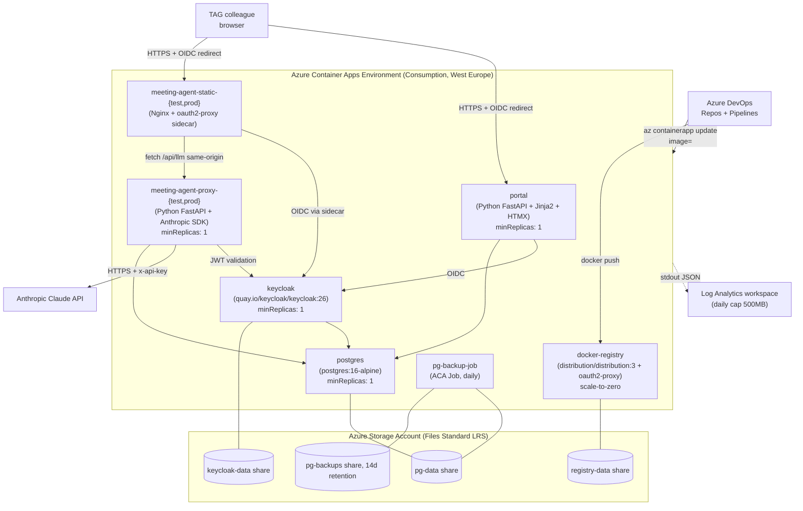

# ARCHITECTURE — Container-Apps-only + Python rebuild

**Project:** vibecoding-platform
**Researched:** 2026-05-30 (Sessie 2 — scope reduction)
**Confidence:** HIGH

---

## 1. Component Diagram (Phase 1 pilot)



---

## 2. Component Inventory

| Component | Purpose | Image / Lang | Phase-1 size |
|-----------|---------|--------------|--------------|
| **Portal** | Login, app list, role admin, audit view, promote trigger | `python:3.12-slim` + FastAPI + Jinja2 + HTMX | 0.5 vCPU / 1 GiB, `minReplicas: 1` |
| **Meeting Agent — static** | Serves Claude artifact HTML/JS | `nginx:1.27-alpine` + `oauth2-proxy:7.6` sidecar | test: 0.25/0.5 scale-to-zero, prod: 0.5/1 minR1 |
| **Meeting Agent — LLM proxy** | `POST /api/llm`. Postgres-backed daily cap + per-user rate-limit. Calls Anthropic. | `python:3.12-slim` + FastAPI + `anthropic` SDK | 0.25/0.5 both `minReplicas: 1` (cap-state correctness) |
| **Keycloak** | OIDC SSO | `quay.io/keycloak/keycloak:26` | 0.5/1, `minReplicas: 1`. Realm export in `infra/keycloak/realm-export.json`. |
| **Postgres** | Single DB server. Schemas: `portal`, `proxy_meeting_agent_test`, `proxy_meeting_agent_prod`, `keycloak`. | `postgres:16-alpine` | 0.5/1, `minReplicas: 1`. `/var/lib/postgresql/data` on Azure Files mount. |
| **Docker Registry** | Self-hosted image registry | `distribution/distribution:3` + `oauth2-proxy:7.6` sidecar | 0.25/0.5, scale-to-zero. `/var/lib/registry` on Azure Files. |
| **pg-backup job** | Container Apps Job, daily cron, dumps to second Azure Files share | `postgres:16-alpine` (uses `pg_dump`) | Scheduled, 14d retention on backups share. |
| **Storage Account + Azure Files** | Persistent volumes | Standard LRS | ~10 GiB total across 4 shares |
| **Log Analytics** | Log sink (required by ACA Env) | — | Daily cap 500 MB, 30d retention |
| **ADO Repos + Pipelines** | Monorepo + path-triggered pipelines per artifact + SP-secret service connection | — | 1 org, 1 project, ~5 pipelines |

---

## 3. Trust + Identity Flow

```
TAG colleague
  │  HTTPS to *.azurecontainerapps.io
  ▼
┌──────────────────────────────────────────────────────────────┐
│                Container Apps Environment                    │
│                                                              │
│   ┌──────────────────┐    ┌────────────────────────────┐     │
│   │ portal           │    │ meeting-agent-static       │     │
│   │ Authlib OIDC     │    │ oauth2-proxy sidecar (OIDC)│     │
│   │ session cookie   │    │ session cookie + JWT       │     │
│   └────────┬─────────┘    └────────┬───────────────────┘     │
│            │                       │                         │
│            │ (server-side          │ fetch /api/llm          │
│            │  Authlib redirect)    │ same-origin             │
│            ▼                       ▼                         │
│   ┌──────────────────┐    ┌────────────────────────────┐     │
│   │ keycloak         │◄───┤ meeting-agent-proxy        │     │
│   │ (OIDC issuer)    │    │ validates Keycloak JWT     │     │
│   └────────┬─────────┘    └────────┬───────────────────┘     │
│            │                       │                         │
│            ▼                       ▼                         │
│       ┌─────────────────────────────────┐                    │
│       │ self-host postgres (multi-schema)│                    │
│       │ portal | proxy_* | keycloak     │                    │
│       └─────────────────────────────────┘                    │
└──────────────────────────────────────────────────────────────┘
                                  │
                                  ▼  (proxy only)
                       Anthropic Claude API
```

**Rules:**

- **Only the LLM-proxy holds the Anthropic key**, injected via Container Apps `secrets:` env-var.
- **Static artifact never receives any key** — fetches `/api/llm` same-origin; proxy validates Keycloak JWT then calls Anthropic.
- **Single Keycloak realm `vibecoding`** with two clients (`portal` public client + PKCE; `meeting-agent-proxy` confidential client OR JWT validation by issuer-key). Two roles: `Admin`, `Developer`.
- **Postgres is the only stateful store**; one server, multiple schemas. Connection strings differ per app via ACA-secret.

---

## 4. Auth flow detail

### 4.1 Portal login

1. Browser → `portal…/dashboard` → portal middleware sees no session cookie → 302 to Keycloak `/realms/vibecoding/protocol/openid-connect/auth?...`
2. Keycloak authenticates user (lokale Keycloak-DB; in Phase 2 federated naar TAG Microsoft tenant)
3. Redirect back to `portal…/auth/callback` with code → Authlib exchanges for tokens → sets session cookie (httpOnly, secure, sameSite=lax)
4. Portal middleware extracts `sub` + `realm_access.roles`, queries Postgres `app_users` for canonical role
5. Dashboard renders

### 4.2 User uses Meeting Agent

1. Browser → `meeting-agent-prod…/` → `oauth2-proxy` sidecar (port 4180) intercepts → 302 to Keycloak
2. After login → oauth2-proxy sets session cookie → forwards to Nginx (port 80) which serves static
3. Static page calls `fetch('/api/llm', ...)` same-origin (cookie sent)
4. ACA ingress routes `/api/llm` to `meeting-agent-proxy` Container App
5. Proxy validates JWT in cookie against Keycloak public key (cached + refreshed every 5 min)
6. Proxy does Postgres `BEGIN; SELECT ... FOR UPDATE; UPDATE; COMMIT;` daily-cap dance
7. Proxy calls Anthropic, returns response, audits `llm_calls` row

### 4.3 Admin promotes test → prod

1. Admin clicks "Promote" in portal
2. Portal `/promote` endpoint checks role = `Admin`
3. Portal triggers ADO pipeline via REST API with parameter `image_digest=<sha256:…>`
4. Pipeline (SP-secret auth) calls self-host registry to **retag** the existing image: `docker tag registry.../meeting-agent-proxy@sha256:abc registry.../meeting-agent-proxy:prod`
5. Pipeline calls `az containerapp update --name meeting-agent-proxy-prod --image registry.../meeting-agent-proxy:prod`
6. Pipeline writes audit row via short-lived DB connection
7. Portal polls pipeline status; UI updates when prod revision is `Running`

---

## 5. Postgres schema layout (single server, multi-schema)

```sql
-- Schema: portal
CREATE TABLE portal.app_users (
  id            UUID PRIMARY KEY DEFAULT gen_random_uuid(),
  sub           TEXT NOT NULL UNIQUE,       -- Keycloak subject claim
  username      TEXT NOT NULL,
  display_name  TEXT NOT NULL,
  role          TEXT NOT NULL CHECK (role IN ('Admin','Developer')),
  created_at    TIMESTAMPTZ NOT NULL DEFAULT now()
);

CREATE TABLE portal.apps (
  id            UUID PRIMARY KEY DEFAULT gen_random_uuid(),
  name          TEXT NOT NULL UNIQUE,
  display_name  TEXT NOT NULL,
  test_url      TEXT,
  prod_url      TEXT,
  owner_sub     TEXT REFERENCES portal.app_users(sub),
  created_at    TIMESTAMPTZ NOT NULL DEFAULT now()
);

CREATE TABLE portal.audit_log (
  id            BIGSERIAL PRIMARY KEY,
  actor_sub     TEXT NOT NULL,
  action        TEXT NOT NULL,
  target        TEXT NOT NULL,
  metadata      JSONB,
  occurred_at   TIMESTAMPTZ NOT NULL DEFAULT now()
);
-- app role gets INSERT, SELECT only; UPDATE/DELETE revoked.

-- Schema: proxy_meeting_agent_{test,prod}
CREATE TABLE daily_cap (
  day           DATE PRIMARY KEY,
  spent_cents   BIGINT NOT NULL DEFAULT 0
);

CREATE TABLE rate_limit (
  key           TEXT PRIMARY KEY,
  points        INT NOT NULL,
  expire        TIMESTAMPTZ NOT NULL
);

CREATE TABLE llm_calls (
  id            BIGSERIAL PRIMARY KEY,
  user_sub      TEXT NOT NULL,
  model         TEXT NOT NULL,
  input_tokens  INT NOT NULL,
  output_tokens INT NOT NULL,
  cache_create  INT NOT NULL DEFAULT 0,
  cache_read    INT NOT NULL DEFAULT 0,
  cost_cents    INT NOT NULL,
  occurred_at   TIMESTAMPTZ NOT NULL DEFAULT now()
);

-- Schema: keycloak -> populated/managed by Keycloak itself on first start.
```

Daily-cap transaction stays identical (see SUMMARY).

---

## 6. Repo + CI/CD layout

```
vibecoding-platform/
├─ .planning/
├─ docs/
│  ├─ architecture.md
│  ├─ runbook.md
│  ├─ onboarding.md
│  ├─ it-request.md
│  └─ management.md
├─ infra/
│  ├─ main.bicep                  (single file, no AVM)
│  ├─ main.bicepparam
│  └─ keycloak/
│     └─ realm-export.json
├─ apps/
│  ├─ portal/                     (Python FastAPI)
│  │  ├─ Dockerfile
│  │  ├─ pyproject.toml
│  │  ├─ src/
│  │  └─ alembic/
│  └─ meeting-agent/
│     ├─ static/                  (Nginx-served HTML)
│     │  ├─ Dockerfile
│     │  ├─ html/
│     │  └─ oauth2-proxy.cfg
│     └─ proxy/                   (Python FastAPI)
│        ├─ Dockerfile
│        ├─ pyproject.toml
│        └─ src/
├─ pipelines/                     (Azure DevOps YAML)
│  ├─ portal.yml
│  ├─ meeting-agent-static.yml
│  ├─ meeting-agent-proxy.yml
│  ├─ infra.yml
│  ├─ keycloak-realm-sync.yml
│  └─ promote.yml
└─ README.md
```

**Image promotion = retag in self-host registry**, no rebuild. Same digest → exact same bits.

**SP-secret service connection**: rotate every 90 days; rotation procedure in runbook.

---

## 7. Test/Prod separation

Same as before: **single Container Apps Environment, suffix-naming** (`meeting-agent-test`, `meeting-agent-prod`, etc.). One Postgres server with logical schemas per env (`proxy_meeting_agent_test`, `proxy_meeting_agent_prod`). One Keycloak instance shared (single realm `vibecoding`); roles + clients in one realm.

---

## 8. Suggested build order (Phase 1)

| Order | Topic | Outputs |
|-------|-------|---------|
| 1 | Bicep skeleton + RG | RG, Storage Account + Files shares, LAW, ACA Env |
| 2 | Self-host registry + oauth2-proxy + Keycloak realm-export checked-in | Registry callable + Keycloak running |
| 3 | Self-host Postgres deployed; pg_dump-job scheduled; restore-drill validated | DB online + backup tested |
| 4 | Portal stub (login-only) wired to Keycloak via Authlib | E2E SSO contract validated |
| 5a + 5b (parallel) | Portal real features (dashboard, admin, audit) **AND** LLM-proxy + daily-cap | Pilot live |
| 6 | Meeting Agent static + oauth2-proxy sidecar | Pilot E2E |
| 7 | All ADO pipelines path-triggered + Trivy + smoke tests | Push-to-deploy |
| 8 | Docs (DOC-01..06) | Phase done |
| 9 | Promote pipeline + portal trigger + audit | Production handover |

---

## 9. Networking

Public ingress, no VNET (same rationale as before: all traffic gated by Keycloak OIDC).

---

## 10. Observability minimum

| Signal | Source | Alert |
|--------|--------|-------|
| Failed requests | structlog JSON in LAW (KQL `where status >= 500`) | > 5% over 5 min |
| Daily cap warn | proxy emits `spent_cents` metric to stdout | spent > 80% of cap |
| LAW ingest cost | Azure Cost Mgmt | budget alert €15 + €30 |
| Postgres CPU/mem | ACA built-in metrics | CPU > 80% sustained 10 min |
| Replica restart loop | LAW Kusto on system logs | > 3 restarts in 10 min |
| pg_dump-job last success | last `audit_log` row from job | > 36h since last success |

Dashboards: one Azure Workbook on the LAW, one cost-overview pinned to Azure Portal home.

---

## 11. Decisions locked here

| # | Decision | Rationale |
|---|----------|-----------|
| A1 | Single ACA Env, suffix-naming for test/prod | Cheapest, simplest |
| A2 | Single Keycloak realm `vibecoding`, two clients (`portal`, `meeting-agent-proxy`) | One source of role definitions |
| A3 | Source of truth for roles = Postgres `portal.app_users` (seeded from Keycloak role-claim) | TAG-admin can manage in either side |
| A4 | `oauth2-proxy` sidecar for static + registry; Authlib in portal + proxy | Sidecar pattern keeps Nginx + distribution images unchanged |
| A5 | Daily-cap = Postgres `SELECT … FOR UPDATE` + 90% margin | Race-safe |
| A6 | Promote = retag in self-host registry | Production runs the bits tested |
| A7 | Monorepo + path-triggered ADO pipelines | Same as before |
| A8 | SP-secret service connection, 90d rotation | Matches self-host strategy; no WIF |
| A9 | Public ingress, no VNET | Threat-model accepts |
| A10 | structlog JSON to ACA stdout, no App Insights | Cost-zero observability |
