# ARCHITECTURE — Internal App-Hosting Platform on Azure Container Apps

**Project:** vibecoding-platform
**Researched:** 2026-05-30
**Confidence:** HIGH — synthesized from STACK.md decisions, FEATURES.md scope, and standard Azure Container Apps architectural patterns. Verified against Microsoft Learn.

---

## 1. Component Diagram (Phase 1 pilot)

```mermaid
flowchart TB
  subgraph Browser
    user[TAG colleague]
  end

  subgraph AzureAD["Microsoft Entra ID (TAG tenant)"]
    app_reg["App registration<br/>vibecoding-platform"]
  end

  subgraph ACAEnv["Azure Container Apps Environment<br/>cae-vibecoding-pilot (West Europe)"]
    portal["portal<br/>(Next.js 15 + Auth.js v5)<br/>1 instance"]
    pilot_static["meeting-agent-static-{test,prod}<br/>(Nginx + Easy Auth)"]
    pilot_proxy["meeting-agent-proxy-{test,prod}<br/>(Node Express + Easy Auth)"]
  end

  subgraph DataPlane["Data plane"]
    pg["Azure DB for PostgreSQL<br/>Flex Server B1ms (single)"]
    kv["Azure Key Vault<br/>(RBAC, MI-only)"]
    acr["Azure Container Registry<br/>Basic SKU"]
  end

  subgraph Obs["Observability"]
    law["Log Analytics workspace"]
    ai["Application Insights<br/>(workspace-based)"]
  end

  subgraph CICD["Azure DevOps"]
    ado_repo["Repos<br/>(monorepo)"]
    ado_pipe["Pipelines<br/>+ WIF service connection"]
  end

  user -->|HTTPS + AAD SSO| portal
  user -->|HTTPS + AAD SSO via Easy Auth| pilot_static
  pilot_static -->|fetch /api/llm<br/>session cookie| pilot_proxy
  pilot_proxy -->|HTTPS<br/>x-api-key header| anthropic["Anthropic Claude API"]

  portal -->|MI| pg
  pilot_proxy -->|MI| pg
  pilot_proxy -->|MI: read claude-api-key| kv
  portal -->|MI: read auth-secret| kv

  portal -.->|/.auth| app_reg
  pilot_static -.->|/.auth/login/aad| app_reg

  ado_pipe -->|WIF token| acr
  ado_pipe -->|WIF token| ACAEnv
  ado_repo --> ado_pipe

  ACAEnv -.->|stdout/stderr| law
  ACAEnv -.->|telemetry| ai
  pg -.->|slow-query log| law
```



---

## 2. Component Inventory

| Component | Purpose | Tech | Phase-1 size |
|-----------|---------|------|--------------|
| **Portal** | Login, app list, role admin, audit view, promote trigger | Next.js 15 + Auth.js v5 + Prisma + Tailwind + shadcn/ui | 1 Container App (Consumption), `minReplicas: 0`, `maxReplicas: 2`, 0.5 vCPU / 1 GiB |
| **Meeting Agent — static** | Serves the Claude-generated HTML/JS artifact | Nginx (alpine) + Container Apps Easy Auth | 2 Container Apps (test, prod). Test: 0.25 vCPU / 0.5 GiB, scale-to-zero. Prod: 0.5 vCPU / 1 GiB, `minReplicas: 1` |
| **Meeting Agent — LLM proxy** | Single `/api/llm` endpoint. Enforces per-user rate-limit + Postgres-backed daily cap. Calls Anthropic API. | Node 22 LTS + Express 5 + `@anthropic-ai/sdk` + `rate-limiter-flexible` (PG store) | 2 Container Apps (test, prod). Both `minReplicas: 1` (cap-state correctness — see PITFALLS CRIT-1) |
| **Postgres** | Portal data (apps, users-with-roles, audit_log), LLM-proxy daily-cap counters, rate-limiter store | Azure DB for PostgreSQL Flexible Server B1ms, pgbouncer ON, single instance | 1 DB server, 4 logical DBs: `portal`, `proxy_meeting_agent_test`, `proxy_meeting_agent_prod`, `_admin` |
| **Key Vault** | Secrets: `claude-api-key`, `auth-secret` (Auth.js), DB passwords (per-app role) | Azure Key Vault, RBAC enabled | 1 KV |
| **ACR** | Container images for all apps | Azure Container Registry, Basic SKU, retention policy 7d for untagged | 1 registry |
| **Log Analytics + App Insights** | Logs, traces, alerts, dashboards | Workspace-based App Insights, daily-cap 1 GB | 1 LAW |
| **Azure AD app-registration** | Single app-reg for portal + pilot apps. Audience v2. App-roles: `Admin`, `Developer`. | Entra ID | 1 app-reg, 1 client-secret OR none if WIF only |
| **ADO Repos + Pipelines** | Monorepo + path-triggered pipelines per artifact | Azure DevOps Services | 1 org, 1 project, ~5 pipelines |

---

## 3. Trust + Identity Boundaries

```
TAG colleague
  │  (Azure AD SSO — Entra ID, tenant-pinned, v2 tokens)
  ▼
┌──────────────────────────────────────────────────────────────┐
│              Container Apps Environment                      │
│                                                              │
│   ┌──────────────┐                ┌──────────────────────┐   │
│   │ portal       │                │ meeting-agent-static │   │
│   │ Auth.js v5   │                │ Easy Auth (AAD)      │   │
│   │ JWT session  │                │ (no app code)        │   │
│   └─────┬────────┘                └──────────┬───────────┘   │
│         │ session cookie                     │ session cookie│
│         │                                    │ + same-origin │
│         │                                    ▼               │
│         │                    ┌─────────────────────────┐     │
│         │                    │ meeting-agent-proxy     │     │
│         │                    │ validates Easy Auth     │     │
│         │                    │ header `x-ms-client-..` │     │
│         │                    └────┬────────────────────┘     │
│         │                         │                          │
│         └────┐         ┌──────────┘                          │
│              ▼         ▼                                     │
│      ┌───────────────────┐    ┌────────────────────┐         │
│      │ Postgres          │    │ Key Vault          │         │
│      │ via MI (AAD-auth) │    │ via MI (RBAC)      │         │
│      └───────────────────┘    └────────────────────┘         │
└──────────────────────────────────────────────────────────────┘
                                  │
                                  ▼
                       Anthropic Claude API (only proxy talks)
```

**Rules:**

- **Only the LLM-proxy ever holds the Claude API key**, fetched at startup via MI from Key Vault.
- **The static artifact never receives the Claude key**, period — pilot-app fetches `/api/llm` same-origin; the proxy holds and uses the key.
- **MI is system-assigned per Container App** for least-privilege RBAC on KV and Postgres.
- **One Entra app-registration** for both portal and pilot apps; differentiation via app-roles (`Admin`, `Developer`) checked in portal code, and via Easy Auth's `x-ms-client-principal` header in the proxy.

---

## 4. Easy Auth ↔ Auth.js v5 — who handles auth where

| Surface | Auth mechanism | Why |
|---------|---------------|-----|
| **Portal** (`portal.vibecoding…`) | Auth.js v5 with `microsoft-entra-id` provider, JWT session, `trustHost: true` | Portal needs per-user role lookup from Postgres + audit logging + role-based UI. Auth.js gives flexible session + DB adapter path. |
| **Meeting-agent-static** (`meeting-agent-{test,prod}.vibecoding…`) | Container Apps **Easy Auth** (Entra ID) | Static artifact has no server code. Easy Auth wraps Nginx with zero-code SSO. Eliminates a whole class of pilot-app auth bugs. |
| **Meeting-agent-proxy** (same hostname as static, different path) | Easy Auth (inherited from same Container App if co-deployed) **OR** session cookie passed from static side if separate Container Apps | Proxy must know *which user* called it (for per-user rate-limit + audit). Both options pass the user identity via the `x-ms-client-principal` HTTP header. |

**Single app-registration vs split:** Use **one** app-registration named `vibecoding-platform` with two redirect URIs:
1. `https://portal…/api/auth/callback/microsoft-entra-id` (Auth.js callback)
2. `https://meeting-agent-test…/.auth/login/aad/callback` and prod equivalent (Easy Auth callback)

Single app-reg simplifies role-management (app-roles defined once, checked by both portal and proxy) and avoids consent-screen duplication for users.

**Roles model:**

- Entra ID app-roles `Admin` and `Developer` are defined in the app-registration manifest.
- TAG IT (or admin in portal-DB after first login) assigns roles to users.
- **Source of truth for roles in Phase 1 = Postgres `app_users` table.** Entra app-roles claim is checked on first login for bootstrap, then DB is authoritative.
- Decision logged: `Authoritative role store = Postgres` (move to Entra-groups-only in Phase 2 if TAG IT prefers).

---

## 5. Data flows

### 5.1 User logs into the portal

1. Browser → `portal.vibecoding…/dashboard` → 302 (Auth.js middleware) → `login.microsoftonline.com/<tenant>/oauth2/v2.0/authorize`
2. User selects Microsoft account → consent (if first-time) → redirected back to `portal…/api/auth/callback/microsoft-entra-id` with auth code
3. Auth.js exchanges code → ID token + access token → JWT session cookie set
4. Portal middleware on every request: `if (token.tid !== AZURE_TENANT_ID) return 403`
5. Portal queries Postgres `app_users WHERE upn = token.preferred_username` for role
6. Dashboard renders

### 5.2 User uses Meeting Agent

1. Browser → `meeting-agent-prod…/` → Easy Auth 302 → AAD login → callback → cookie set
2. Static page loads
3. Page calls `fetch('/api/llm', { method: 'POST', body: { prompt } })` same-origin (session cookie included)
4. Easy Auth verifies cookie, injects `x-ms-client-principal` header containing user UPN
5. Express LLM-proxy:
   - Reads UPN from header
   - Postgres transaction: `SELECT ... FOR UPDATE` on `daily_cap WHERE day = CURRENT_DATE`
   - Checks per-user rate-limit (`rate-limiter-flexible` Postgres store)
   - If under cap → calls Anthropic API
   - Reads `usage` block from response; updates `daily_cap.spent_cents += actual_cost`; commits
6. Response returned to browser

### 5.3 Admin promotes test → prod

1. Admin clicks "Promote" in portal
2. Portal API route checks `role === 'Admin'`
3. Portal calls ADO REST API: trigger `promote-meeting-agent` pipeline with parameter `image_tag=<sha>`
4. Pipeline (WIF auth): `az containerapp update --image meeting-agent:<sha> --resource-group rg-vibecoding-pilot --name meeting-agent-prod`
5. Pipeline writes audit row to portal DB: `(actor, action, target, image_tag, timestamp)` via temporary MI access
6. Portal polls pipeline status; UI updates when revision is `Running`

---

## 6. Postgres schema (Phase 1 minimum)

```sql
-- portal DB
CREATE TABLE app_users (
  id              UUID PRIMARY KEY DEFAULT gen_random_uuid(),
  upn             TEXT NOT NULL UNIQUE,         -- e.g. j.polleunis@tag-team.be
  display_name    TEXT NOT NULL,
  role            TEXT NOT NULL CHECK (role IN ('Admin','Developer')),
  created_at      TIMESTAMPTZ NOT NULL DEFAULT now()
);

CREATE TABLE apps (
  id              UUID PRIMARY KEY DEFAULT gen_random_uuid(),
  name            TEXT NOT NULL UNIQUE,         -- e.g. meeting-agent
  display_name    TEXT NOT NULL,
  test_url        TEXT,                          -- ACA FQDN
  prod_url        TEXT,
  owner_upn       TEXT REFERENCES app_users(upn),
  created_at      TIMESTAMPTZ NOT NULL DEFAULT now()
);

CREATE TABLE audit_log (
  id              BIGSERIAL PRIMARY KEY,
  actor_upn       TEXT NOT NULL,
  action          TEXT NOT NULL,                 -- 'role_change' | 'promote_test_to_prod' | …
  target          TEXT NOT NULL,                 -- app name or user upn
  metadata        JSONB,
  occurred_at     TIMESTAMPTZ NOT NULL DEFAULT now()
);
-- App role: GRANT INSERT, SELECT ON audit_log TO portal_app_role; REVOKE UPDATE, DELETE.

-- proxy_meeting_agent_{test,prod} DBs (one per env, blast-radius isolation)
CREATE TABLE daily_cap (
  day           DATE PRIMARY KEY,
  spent_cents   BIGINT NOT NULL DEFAULT 0
);

CREATE TABLE rate_limit (                       -- rate-limiter-flexible PG schema
  key           TEXT PRIMARY KEY,
  points        INT NOT NULL,
  expire        TIMESTAMPTZ NOT NULL
);

CREATE TABLE llm_calls (                        -- audit + reconciliation
  id            BIGSERIAL PRIMARY KEY,
  user_upn      TEXT NOT NULL,
  model         TEXT NOT NULL,
  input_tokens  INT NOT NULL,
  output_tokens INT NOT NULL,
  cache_create  INT NOT NULL DEFAULT 0,
  cache_read    INT NOT NULL DEFAULT 0,
  cost_cents    INT NOT NULL,
  occurred_at   TIMESTAMPTZ NOT NULL DEFAULT now()
);
```

**Daily-cap transaction pattern:**

```sql
BEGIN;
INSERT INTO daily_cap (day) VALUES (CURRENT_DATE) ON CONFLICT DO NOTHING;
SELECT spent_cents FROM daily_cap WHERE day = CURRENT_DATE FOR UPDATE;
-- in app:
--   if spent_cents + 0.9 * cap_cents > cap_cents → ROLLBACK, return HTTP 429
--   else continue
UPDATE daily_cap SET spent_cents = spent_cents + :actual_cost WHERE day = CURRENT_DATE;
COMMIT;
```

The "90% safety margin" sub-cap (CRIT-2) absorbs race-condition slack from multiple replicas.

---

## 7. Repo + CI/CD topology

### 7.1 Monorepo layout

```
vibecoding-platform/
├─ .planning/                 (PROJECT.md, ROADMAP.md, research/, …)
├─ docs/
│  ├─ architecture.md         (DOC-01)
│  ├─ runbook.md              (DOC-02)
│  ├─ onboarding.md           (DOC-03)
│  └─ it-request.md           (DOC-04)
├─ infra/                     (Bicep)
│  ├─ main.bicep
│  ├─ main.bicepparam
│  └─ modules/                (avm modules pinned)
├─ apps/
│  ├─ portal/                 (Next.js)
│  │  ├─ Dockerfile
│  │  └─ src/
│  └─ meeting-agent/
│     ├─ static/              (Nginx-served HTML, copied from Claude artifact)
│     │  └─ Dockerfile
│     └─ proxy/               (Node Express)
│        ├─ Dockerfile
│        └─ src/
├─ pipelines/                 (Azure DevOps YAML)
│  ├─ portal.yml
│  ├─ meeting-agent-static.yml
│  ├─ meeting-agent-proxy.yml
│  ├─ infra.yml
│  └─ promote.yml             (manual-trigger promotion)
└─ README.md
```

### 7.2 Pipeline pattern

| Pipeline | Trigger | Stages |
|----------|--------|--------|
| `infra.yml` | path `infra/**` on main | bicep what-if → bicep deploy (RG-scope) → smoke test (RG exists, KV reachable) |
| `portal.yml` | path `apps/portal/**` | install → typecheck → test → docker build → Trivy scan → push ACR → ACA update (revision suffix = git sha) → smoke test (302 to login.microsoftonline.com) |
| `meeting-agent-static.yml` | path `apps/meeting-agent/static/**` | docker build (Nginx + assets) → Trivy → push → ACA update (test only) |
| `meeting-agent-proxy.yml` | path `apps/meeting-agent/proxy/**` | install → test → docker → Trivy → push → ACA update (test only) → run `/healthz/secrets` |
| `promote.yml` | manual trigger from portal (POST to ADO REST API with admin token) | retag image `test → prod` in ACR → ACA update on `-prod` app → audit-log row |

**Image promotion pattern:** **retag the same digest**, do not rebuild. This guarantees prod = the bits that were tested. Tag scheme: `meeting-agent:<git-sha>` (immutable) + `meeting-agent:test-latest` + `meeting-agent:prod-latest` (mutable aliases for ops convenience).

**WIF setup:**
- One user-assigned managed identity per environment: `mi-vibecoding-pilot` (shared dev+pilot in Phase 1).
- Federated credential subject claim format: `sc://<org>/<project>/<service-connection-name>` — verified post-create with `az identity federated-credential show`.
- RBAC: Contributor on the RG only (not subscription) — MIN-5.

---

## 8. Test/Prod separation (decision recap)

**Chosen: single Container Apps Environment, suffix-naming.** Rationale:

- Two Container Apps per app: `meeting-agent-test` + `meeting-agent-prod`, both in `cae-vibecoding-pilot`.
- Resource-limits per app match the table from PROJECT.md (test 0.5 vCPU / 1 GiB / scale-to-zero / max 1; prod 2 vCPU / 4 GiB / `minReplicas: 1` / max 5 / CPU>70% scale).
- Single Postgres server; **two logical DBs** per stateful app (`proxy_meeting_agent_test`, `proxy_meeting_agent_prod`) so test data and prod data don't share tables.
- Single Key Vault but **two secret names per pair**: `claude-api-key--test` and `claude-api-key--prod`.
- Single LAW; logs filtered by Container App name in Kusto queries.

**Trade-off accepted:** ACA Environment = same VNET = no network isolation between test and prod. Acceptable for pilot. Migration to two-env in Phase 2 if Postgres or compliance requires it (Bicep change of ~30 lines).

---

## 9. Suggested build order (Phase 1)

Derived from the dependency graph:

| Order | Topic | Outputs | Unblocks |
|-------|-------|---------|----------|
| **1.** | Bicep skeleton + RG bootstrap | RG, KV (empty), Log Analytics, App Insights, ACR, ACA Env | All container deploys |
| **2.** | Entra app-registration + WIF service connection | App-reg, federated credential, RBAC on RG | CI/CD + Easy Auth + Auth.js |
| **3.** | Postgres Flex + pgbouncer + initial schema | DB up, schemas migrated, MI granted | Portal + proxy data layer |
| **4.** | Portal stub (login only) + Easy Auth on a dummy ACA app | SSO validated end-to-end before real app code | All other apps trust the auth contract |
| **5a + 5b (parallel)** | Portal real features (dashboard, admin, audit view) **AND** LLM-proxy + daily-cap implementation | Portal usable; proxy callable | "Live" pilot |
| **6.** | Meeting Agent static (Nginx) + integration with proxy | Pilot app actually works | UAT |
| **7.** | All pipelines wired in ADO (path-triggered) + Trivy + smoke tests | Push-to-deploy + image-scan gate | Phase-completion |
| **8.** | Documentation: architecture, runbook, onboarding, IT-request | DOC-01..05 | Phase done |
| **9.** | Promote-test→prod pipeline + portal trigger + audit | Promotion flow E2E | Production handover to TAG |

Steps 5a + 5b are explicitly parallel — they share no code (portal = Next.js, proxy = Node Express) and only meet at the Postgres schema (defined in step 3). Two developers, one each.

---

## 10. Onboarding a new app

**Phase 1 — manual (admin only):**
1. Admin creates `apps/<new-app>/` folder in monorepo with `Dockerfile` + ACA Bicep snippet.
2. Admin adds row in portal DB `apps` table with name + owner.
3. Admin runs `infra.yml` pipeline to deploy the new Container App (`-test` and `-prod`).
4. Admin assigns Easy Auth → same Entra app-reg → same Admin/Developer roles automatically apply.
5. Admin pushes initial image via the new path-triggered pipeline.
6. App appears in portal dashboard (auto-discovered from DB).

**Phase 2 — self-service (future, NOT in Phase 1 scope):**
- Developer pushes to a per-app branch with a template repo.
- Portal "Add app" wizard creates DB row + triggers Bicep + creates pipeline (Bicep-from-Bicep loop).
- Approval gate (admin review) before first prod deploy.

---

## 11. Networking

**Public ingress, no VNET** — Phase 1 only. Acceptable because:
- All apps require AAD SSO (no anonymous traffic).
- ACA default HTTPS termination is fine.
- VNET-integration adds ~€60/month minimum + complexity not justified by pilot threat model.

**Phase 2+ considerations:** if any pilot app handles client-confidential data, move ACA Env to VNET-integrated mode + Private Endpoints for Postgres & KV (~€100/month extra).

---

## 12. Observability minimum (Phase 1)

| Signal | Tool | Alert rule |
|--------|------|------------|
| Failed request rate (portal + proxy) | App Insights | > 5% over 5 min |
| Daily cap warn | Custom metric from proxy | spent_cents > 80% of cap |
| LAW ingest cost | Cost Management | budget alert at €50 + €100 |
| Postgres CPU credits | Azure Monitor | `cpu_credit_balance` < 200 |
| ACA replica restart loop | LAW Kusto on `ContainerAppSystemLogs` | > 3 restarts in 10 min |
| Cert expiry (only relevant once custom domain exists) | Azure Monitor | < 14 days |

Dashboards: one App Insights workbook per env + one cost-overview pinned to Azure Portal home.

---

## 13. Decisions locked here

| # | Decision | Rationale |
|---|---------|-----------|
| A1 | Single Container Apps Environment, suffix-naming for test/prod | Cheapest, simplest for pilot; isolation via app-level resource limits |
| A2 | Single Entra app-registration, app-roles `Admin` + `Developer` | One consent screen, one source of role definitions |
| A3 | Source of truth for user roles = Postgres `app_users`, seeded from Entra app-roles claim on first login | Allows TAG IT to manage roles in either Entra or via portal-admin; deferred decision to Phase 2 |
| A4 | Easy Auth for pilot static + proxy; Auth.js v5 for portal | Easy Auth = zero-code SSO for surfaces without per-user state; Auth.js for stateful UI |
| A5 | Daily cap counter = Postgres-backed with `SELECT … FOR UPDATE` + 90% safety margin | Survives container restarts and multi-replica races |
| A6 | Promote = ACR retag (same digest), not rebuild | Production runs the exact bits tested in test |
| A7 | Monorepo + path-triggered ADO pipelines | One repo for 2 devs; per-app pipelines triggered only when that app changes |
| A8 | WIF for ADO→Azure; no long-lived SP secrets | Microsoft default 2026; no secret rotation burden |
| A9 | Public ingress, no VNET in Phase 1 | Threat-model accepts public surface protected by AAD; defer VNET to Phase 2 if needed |
| A10 | Application Insights workspace-based, sampled (20% dev, 5% proxy prod) | Cost containment within €100 budget |
