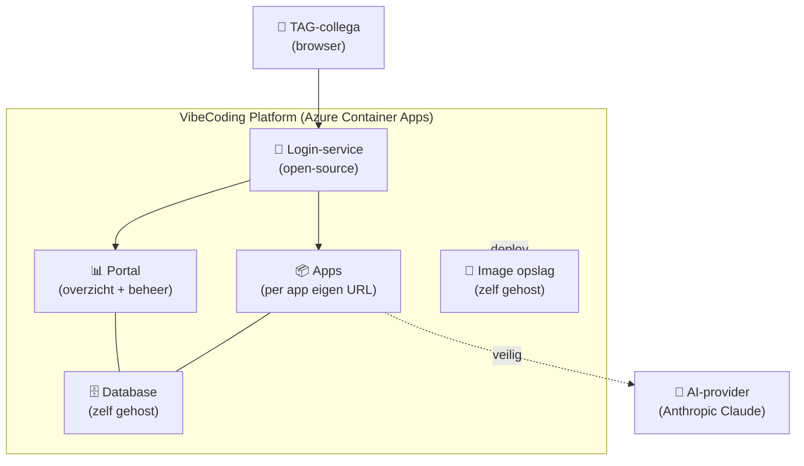

# VibeCoding Platform — Management briefing

*Versie 1 — 2026-05-30. Voor TAG management. Eén pagina pitch, daarna detail. ±5 min leestijd.*

---

## Wat het platform doet

VibeCoding is een intern lanceer-platform voor "vibecoded" applicaties — kleine apps die TAG-collega's met behulp van Claude (of vergelijkbare AI-tools) in een dag of een week in elkaar zetten. Vandaag blijven die apps hangen in een chat-venster: collega's kunnen ze niet openen, beheerders weten niet wat er draait, en er is geen veiligheidsnet voor API-sleutels of kosten.

VibeCoding verandert dat in: één Microsoft-login → werkende app op een TAG-URL. De ontwikkelaar focust op het idee, het platform zorgt voor login, hosting, kosten-bewaking en versie-beheer. We starten met één pilot-app (Meeting Agent) en breiden uit zodra het patroon bewezen is.

---

## Voor wie

| Rol | Wat ze willen | Wat het platform levert |
|-----|---------------|--------------------------|
| **TAG-developer** | Idee delen met collega's zonder cloud-knowhow | Push naar git → app staat online |
| **TAG-collega (gebruiker)** | App gebruiken zonder nieuwe wachtwoorden | Eén Microsoft-login → klaar |
| **Admin** | Overzicht + ingrijp-mogelijkheid bij problemen | Dashboard + rol-beheer + promote-knop |
| **IT-verantwoordelijke** | Geen lekkende API-sleutels of ongeauthoriseerde toegang | Sleutels server-side, alles achter SSO, hard daily-cap op AI-kosten |
| **Manager** | Voorspelbare kost + geen verrassingen | < €200/jaar Azure, $10/dag harde AI-limiet |

---

## User stories

1. **Als TAG-developer** wil ik een idee dat ik in Claude maakte delen met collega's zonder zelf cloud te configureren, zodat ik focus houd op het idee.
2. **Als TAG-collega** wil ik met één Microsoft-login alle interne apps gebruiken, zodat ik geen wachtwoorden meer hoef te onthouden.
3. **Als admin** wil ik op één scherm zien welke apps draaien en wie wat doet, zodat ik bij problemen snel kan ingrijpen.
4. **Als IT-verantwoordelijke** wil ik dat géén enkele API-sleutel zichtbaar is in de browser, zodat er geen lekken naar buiten zijn.
5. **Als manager** wil ik dat één buggy app de andere niet kan stilleggen, zodat we durven uit te rollen.
6. **Als manager** wil ik harde dagelijkse limieten op AI-kosten, zodat er nooit factuurverrassingen zijn.

---

## Architectuur in één plaatje

**In gewone woorden:** alles draait in één type Azure-dienst (Container Apps). De rest van wat we nodig hebben — een login-systeem, een database, opslag voor onze app-images — bouwen we niet duur in, maar zetten we zelf in containers neer. Resultaat: weinig Azure-afhankelijkheid, lage kost, alles portable.

---

## Timeline (Phase 1 — pilot)

| Fase | Wat is af aan het eind | Duur |
|------|------------------------|------|
| **1. Foundations** | Lege infra werkt, login werkt | 1.5 week |
| **2. Meeting Agent live** | Pilot-app praat met Claude, geen sleutel-lek | 1 week |
| **3. Kosten-controle** | Hard limiet op AI-uitgave, anti-misbruik | 0.5 week |
| **4. Beheer-portaal** | Overzicht + rol-beheer werkt | 1 week |
| **5. Automatische deploy** | Git-push → app online; promote test→prod | 1 week |
| **6. Documentatie + check** | Alle docs af, alle controles groen | 0.5 week |
| **Totaal pilot** | | **~5.5 weken** |

**Wat staat er na de pilot?** Eén bewezen patroon, één app live, twee TAG-developers die het patroon kennen. Fase 2 (later) breidt uit met self-service voor nieuwe apps, custom domein, en koppeling met TAG's bestaande Nimbus-omgeving.

---

## Kost — Azure Container Apps + opslag

| Component | Schatting per maand |
|-----------|---------------------|
| Portal (Python web-app) | ~€3.5 |
| Database (zelf gehost in container) | ~€4 |
| Login-service (Keycloak in container) | ~€3 |
| Image-registry (zelf gehost) | ~€0.1 |
| LLM-proxy (Python) | ~€2 |
| Meeting Agent prod (statische pagina) | ~€3 |
| Meeting Agent test (zelf-stop bij idle) | ~€0.1 |
| Bestands-opslag (10 GB) | ~€0.5 |
| Log-opslag (5 GB gratis) | €0 |
| **Bruto schatting** | **~€16-20** |
| Gratis-tier aftrek (Azure inbegrepen) | -€5 tot -€10 |
| **Netto effectief** | **~€10-15** |
| **Per jaar (pilot)** | **~€120-180** |

**Wat staat NIET in deze cijfers:**
- **Ontwikkelaars-tijd** — interne medewerkers, geen externe factuur.
- **AI-gebruikskost (Anthropic Claude API)** — apart, met hard plafond van $10/dag (~€280/maand worst case; verwacht veel lager bij normaal pilot-gebruik).

**Voor management vergelijking:** een typische Azure-PaaS-stack (managed database + managed registry + Azure AD + monitoring) zou voor dezelfde pilot ~€100/maand kosten. Wij mikken op €10-15.

---

## Risico's (en wat we ertegen doen)

1. **Zelf-gehoste database = geen automatische backup zoals Azure.** Mitigatie: nachtelijke kopie naar tweede opslag-share + bestaand TAG Python-recovery-platform als extra vangnet.
2. **Login-service is centraal punt** — als die uit ligt, kan niemand in. Mitigatie: altijd minstens één draaiende kopie + readiness-check + config in versiebeheer.
3. **Zelf-gehoste image-opslag** moet achter login zitten of onze images zijn openbaar leesbaar. Mitigatie: gateway-pattern (in containers samen draaiend) afgedwongen door config.
4. **Tijdslijn is eerlijk geschat op ~5.5 weken**, niet 2. We hebben gekozen voor zelfbouw boven managed services — dat geeft kost-voordeel maar kost meer dev-tijd.

---

## Beslissingen die we voor je hebben gemaakt (en kunnen toelichten)

- **Container Apps** als enige Azure-managed dienst — voor vendor-onafhankelijkheid en lage kost.
- **Python (FastAPI)** voor portal en proxy — snelste tijd-tot-MVP, kleine images.
- **Keycloak** voor login — open-source standaard; in Fase 2 koppelen aan Microsoft-tenant zonder de hele platform-architectuur te veranderen.
- **Anthropic Claude** als enige AI-provider in pilot — TAG gebruikt dit al; alternatieven kunnen later via een proxy-laagje toegevoegd worden.
- **Géén** developer-self-service-upload van apps in pilot — te groot security-risico (admin doet de eerste paar deploys handmatig); zodra patroon bewezen, openzetten in Fase 2.

---

## Vragen aan management

1. Akkoord met pilot-budget van **~€200/jaar Azure** + **$10/dag** AI-cap voor Phase 1?
2. Akkoord met **~5.5 weken** pilot-doorlooptijd (2 devs)?
3. TAG IT — kunnen we 1 nieuwe Resource Group + Storage Account + ACA Environment quota + ADO project op dag 1 krijgen?

---

*Vragen of feedback? Contact Jasper Polleunis (`j.polleunis@tag-team.be`).*
